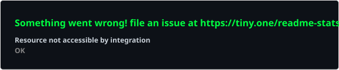

<!--
  ============================================================
  README.md — GitHub Profile for ramijmaraviya764
  ============================================================
  PLACEHOLDERS TO REPLACE (search for "REPLACE_"):
    - REPLACE_PORTFOLIO_URL   -> your real portfolio link
    - REPLACE_LINKEDIN_URL    -> your LinkedIn profile link
    - REPLACE_EMAIL           -> your public contact email (optional)
  Everything else uses your GitHub username: ramijmaraviya764
  ============================================================
-->

<div align="center">


<br>

<pre>
██████╗  █████╗ ███╗   ███╗██╗     ██╗
██╔══██╗██╔══██╗████╗ ████║██║     ██║
██████╔╝███████║██╔████╔██║██║     ██║
██╔══██╗██╔══██║██║╚██╔╝██║██║██   ██║
██║  ██║██║  ██║██║ ╚═╝ ██║███║╚█████╔╝
╚═╝  ╚═╝╚═╝  ╚═╝╚═╝     ╚═╝╚══╝ ╚════╝
</pre>

### `Cybersecurity Student · Web Developer · Security Enthusiast`


<br>

[](https://github.com/ramijmaraviya764)
[](REPLACE_PORTFOLIO_URL)
[](REPLACE_LINKEDIN_URL)
[](https://github.com/ramijmaraviya764)

</div>

<br>

<!-- ============================================================ -->
<!-- TERMINAL-STYLE INTRODUCTION -->
<!-- ============================================================ -->

## 📟 `~/whoami`

```bash
ramij@security:~$ whoami
> Cybersecurity Student & Web Developer

ramij@security:~$ cat about.txt
> Focused on secure web application development, ethical hacking
> fundamentals, web security, and exploring how AI can strengthen
> modern cybersecurity practices. Constantly learning, building,
> and breaking things (safely) to understand how they work.

ramij@security:~$ status
> [ONLINE] Currently learning • Building • Securing
```

<br>

<!-- ============================================================ -->
<!-- ABOUT ME -->
<!-- ============================================================ -->

## 🧠 About Me

```yaml
role:        "Cybersecurity Student & Web Developer"
focus:
  - Secure Web Application Development
  - Ethical Hacking Fundamentals
  - Web Security & Vulnerability Assessment
  - AI-Powered Security Solutions
mindset:      "Learn deeply, build securely, break things to understand them"
currently:    "Strengthening my foundations in security + development"
```

I'm a cybersecurity student and web developer with a strong interest in **ethical hacking**, **web application security**, and the intersection of **AI and cybersecurity**. I enjoy building functional web applications while learning how to secure them properly — treating security as part of the development process, not an afterthought.

<br>

<!-- ============================================================ -->
<!-- CYBERSECURITY SKILLS -->
<!-- ============================================================ -->

## 🔐 Cybersecurity Skills

<div align="center">


</div>

> These are areas I actively study and apply in practice projects — not claims of professional-level mastery.

<br>

<!-- ============================================================ -->
<!-- WEB DEVELOPMENT -->
<!-- ============================================================ -->

## 💻 Web Development

<div align="center">


</div>

<br>

<!-- ============================================================ -->
<!-- SECURITY TOOLS -->
<!-- ============================================================ -->

## 🛠️ Security Tools

<div align="center">


</div>

> Tools I use for learning, practice labs, and personal security assessment projects.

<br>

<!-- ============================================================ -->
<!-- FEATURED PROJECTS -->
<!-- ============================================================ -->

## 🚀 Featured Projects

<table width="100%">
<tr>
<td width="50%" valign="top">

### 🛡️ Cyber Awareness Platform
AI-based cybersecurity awareness platform that educates users about phishing and common cybersecurity threats through interactive content.

`AI` `Cybersecurity` `Phishing Awareness` `Web App`

</td>
<td width="50%" valign="top">

### 📊 Log Analysis using AI
AI-powered web application for analyzing log files to detect suspicious activity and anomalies in system behavior.

`AI` `Log Analysis` `Anomaly Detection` `Python`

</td>
</tr>
<tr>
<td width="50%" valign="top">

### 🔍 Vulnerability Assessment
A web security assessment project performed using Nmap, WhatWeb, cURL, OWASP ZAP, and Browser DevTools to identify potential vulnerabilities.

`Nmap` `OWASP ZAP` `WhatWeb` `Vulnerability Assessment`

</td>
<td width="50%" valign="top">

### ➕ More Projects
Additional projects are documented on my GitHub profile and portfolio as they are completed and verified.

[View all repositories →](https://github.com/ramijmaraviya764?tab=repositories)

</td>
</tr>
</table>

> 📌 **Note:** Pin your actual repositories on your GitHub profile so they appear at the top automatically. Update project descriptions above once repos are public, and consider adding direct links here.

<br>

<!-- ============================================================ -->
<!-- GITHUB ANALYTICS -->
<!-- ============================================================ -->

## 📊 GitHub Analytics

<div align="center">




<br>



</div>

<sub>📌 The stats and top languages cards above are generated automatically by <code>.github/workflows/update-readme-cards.yml</code> and committed to this repo as static SVGs — this avoids depending on the free public github-readme-stats API, which frequently goes down. See <strong>Setup Steps</strong> below.</sub>

<br>

<div align="center">

### 📈 Contribution Graph

<!--
  NOTE: The public github-readme-activity-graph.vercel.app demo service
  is currently down (returns HTTP 402 — the free hosted instance hit its
  usage limit). This is not an issue with your username or the README.
  Uncomment the line below once the service is back online, or self-host
  your own copy — see the troubleshooting notes at the end of this file.


-->

<p><em>Contribution graph temporarily disabled — the free hosting service is down. See troubleshooting notes below.</em></p>

</div>

<br>

<!-- ============================================================ -->
<!-- SECURITY SCAN TERMINAL -->
<!-- ============================================================ -->

## 🛰️ Live Security Scan

<div align="center">


</div>

> This is a self-contained animated SVG stored at `assets/security-scan.svg` — no GitHub Action, no third-party service, no daily job. It just works the moment the file is in your repo.

<br>

<!-- ============================================================ -->
<!-- TECH STACK -->
<!-- ============================================================ -->

## 🧰 Tech Stack

<div align="center">


</div>

<br>

<!-- ============================================================ -->
<!-- CURRENTLY LEARNING -->
<!-- ============================================================ -->

## 📚 Currently Learning

```diff
+ Advanced Web Security
+ Ethical Hacking
+ Penetration Testing
+ Python (for security automation & AI)
+ AI & Machine Learning
+ Secure Web Development Practices
```

<br>

<!-- ============================================================ -->
<!-- 2026 GOALS -->
<!-- ============================================================ -->

## 🎯 2026 Goals

- [ ] Strengthen core cybersecurity and ethical hacking skills
- [ ] Build and ship secure, production-quality web applications
- [ ] Develop practical AI + cybersecurity projects
- [ ] Go deeper into advanced web security topics (auth, OWASP Top 10, secure APIs)
- [ ] Start contributing to open-source security/dev projects
- [ ] Keep a consistent habit of continuous learning and hands-on practice

<br>

<!-- ============================================================ -->
<!-- GITHUB ACTIVITY -->
<!-- ============================================================ -->

## ⚡ GitHub Activity

<div align="center">


</div>

<sub>This reuses the same self-generated stats card from the Analytics section above, so it stays in sync automatically without a second live API call.</sub>

<br>

<!-- ============================================================ -->
<!-- CONNECT WITH ME -->
<!-- ============================================================ -->

## 📡 Connect With Me

<div align="center">

[](https://github.com/ramijmaraviya764)
[](REPLACE_PORTFOLIO_URL)
[](REPLACE_LINKEDIN_URL)
[](mailto:REPLACE_EMAIL)

</div>

<br>

<!-- ============================================================ -->
<!-- SERVICE STATUS NOTE -->
<!-- ============================================================ -->

<sub>
📌 <strong>About the widgets in this README:</strong> the GitHub Stats and Top Languages
cards are generated by your own <code>update-readme-cards.yml</code> workflow and stored as
static files in this repo — they will not go down. The Streak Stats card still calls the
free <code>streak-stats.demolab.com</code> service live; if that one ever breaks, the same
self-hosting approach can be applied. The Contribution Graph widget above is commented out
because the free public instance at <code>github-readme-activity-graph.vercel.app</code>
is currently returning an HTTP 402 error (its hosting quota is exhausted). Two options:
(1) wait — these free instances are usually restored once the billing cycle resets, then
remove the HTML comment around the <code>&lt;img&gt;</code> tag; or (2) fork
<a href="https://github.com/Ashutosh00710/github-readme-activity-graph">Ashutosh00710/github-readme-activity-graph</a>
and deploy your own free copy on Vercel.
</sub>

<br><br>

<!-- ============================================================ -->
<!-- FOOTER -->
<!-- ============================================================ -->

<div align="center">


```
"Security is not a product, but a process."
                                   — Bruce Schneier
```

**© 2026 Ramij Maraviya — Built with curiosity, secured with intent.**

</div>
